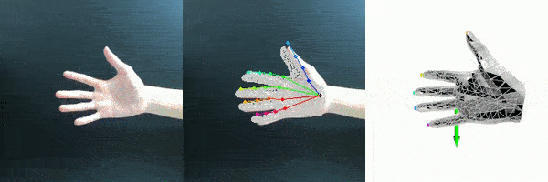

# MobileHand: Real-time 3D Hand Shape and Pose Estimation from Color Image



This repo contains the source code for MobileHand, real-time estimation of 3D hand shape and pose from a single color image running at over 110 Hz on a GPU or 75 Hz on a CPU.

[**Paper**](https://www.researchgate.net/publication/347025951_MobileHand_Real-Time_3D_Hand_Shape_and_Pose_Estimation_from_Color_Image) | [**Project**](https://gmntu.github.io/mobilehand/) | [**Video**](https://www.youtube.com/watch?v=bvVnJkGhJlI)


If you find MobileHand useful for your work, please consider citing
```BibTeX
@inproceedings{MobileHand:2020,
  title     = {MobileHand: Real-time 3D Hand Shape and Pose Estimation from Color Image},
  author    = {Guan Ming, Lim and Prayook, Jatesiktat and Wei Tech, Ang},
  booktitle = {27th International Conference on Neural Information Processing (ICONIP)},
  year      = {2020}
}
```

## Setup
The simplest way to run our implementation is to use anaconda and create an environment called `mobilehand`
```
conda env create -f environment.yaml
conda activate mobilehand
```

Next, download MANO right hand model
* Go to [MANO project page](http://mano.is.tue.mpg.de/)
* Click on _Sign In_ and register for your account
* Download Models & Code (`mano_v1_2.zip`)
* Unzip and copy the file `mano_v1_2/models/MANO_RIGHT.pkl` into the `mobilehand/model` folder

## Demo
```
cd code/ # Change directory to the folder `mobilehand/code/`

python demo.py -m image -d stb      # Test on sample image (STB dataset)
python demo.py -m image -d freihand # Test on sample image (FreiHAND dataset)
python demo.py -m video             # Test on sample video
python demo.py -m camera            # Test with webcam
python demo.py -m camera -c         # Add -c to enable GPU processing
```

## Dataset

##### [2017 ICIP] A Hand Pose Tracking Benchmark from Stereo Matching. [\[PDF\]](https://ieeexplore.ieee.org/document/8296428)  [\[Project\]](https://sites.google.com/site/zhjw1988/) [\[Code\]](https://github.com/zhjwustc/icip17_stereo_hand_pose_dataset)
*Jiawei Zhang, Jianbo Jiao, Mingliang Chen, Liangqiong Qu, Xiaobin Xu, and Qingxiong Yang*


##### [ICCV 2019] FreiHAND: A Dataset for Markerless Capture of Hand Pose and Shape from Single RGB Images. [\[PDF\]](http://openaccess.thecvf.com/content_ICCV_2019/papers/Zimmermann_FreiHAND_A_Dataset_for_Markerless_Capture_of_Hand_Pose_and_ICCV_2019_paper.pdf) [\[Project\]](https://lmb.informatik.uni-freiburg.de/projects/freihand/) [\[Code\]](https://github.com/lmb-freiburg/freihand)
_Christian Zimmermann, Duygu Ceylan, Jimei Yang, Bryan Russell, Max Argus, Thomas Brox_


## Related works

##### [CVPR 2019] Pushing the Envelope for RGB-based Dense 3D Hand Pose Estimation via Neural Rendering. [\[PDF\]](http://openaccess.thecvf.com/content_CVPR_2019/papers/Baek_Pushing_the_Envelope_for_RGB-Based_Dense_3D_Hand_Pose_Estimation_CVPR_2019_paper.pdf)
_Seungryul Baek, Kwang In Kim, Tae-Kyun Kim_


##### [CVPR 2019] 3D Hand Shape and Pose from Images in the Wild. [\[PDF\]](http://openaccess.thecvf.com/content_CVPR_2019/papers/Boukhayma_3D_Hand_Shape_and_Pose_From_Images_in_the_Wild_CVPR_2019_paper.pdf) [\[Code\]](https://github.com/boukhayma/3dhand)
_Adnane Boukhayma, Rodrigo de Bem, Philip H.S. Torr_


##### [CVPR 2019] 3D Hand Shape and Pose Estimation from a Single RGB Image. [\[PDF\]](http://openaccess.thecvf.com/content_CVPR_2019/papers/Ge_3D_Hand_Shape_and_Pose_Estimation_From_a_Single_RGB_CVPR_2019_paper.pdf) [\[Project\]](https://sites.google.com/site/geliuhaontu/home/cvpr2019) [\[Code\]](https://github.com/3d-hand-shape/hand-graph-cnn) *(Oral)*
_Liuhao Ge, Zhou Ren, Yuncheng Li, Zehao Xue, Yingying Wang, Jianfei Cai, Junsong Yuan_


##### [CVPR 2019] Learning joint reconstruction of hands and manipulated objects. [\[PDF\]](https://arxiv.org/pdf/1904.05767.pdf) [\[Code\]](https://github.com/hassony2/manopth) [\[Code\]](https://github.com/hassony2/obman_train) [\[Project\]](https://www.di.ens.fr/willow/research/obman/)
_Yana Hasson, Gül Varol, Dimitris Tzionas, Igor Kalevatykh, Michael J. Black, Ivan Laptev, and Cordelia Schmid_


##### [ICCV 2019] End-to-end Hand Mesh Recovery from a Monocular RGB Image. [\[PDF\]](http://openaccess.thecvf.com/content_ICCV_2019/papers/Zhang_End-to-End_Hand_Mesh_Recovery_From_a_Monocular_RGB_Image_ICCV_2019_paper.pdf)  [\[Code\]](https://github.com/Wavelet303/HAMR)
_Xiong Zhang\*, Qiang Li\*, Wenbo Zhang, Wen Zheng_


##### [CVPR 2020] Weakly-Supervised Mesh-Convolutional Hand Reconstruction in the Wild. [\[PDF\]](https://arxiv.org/pdf/2004.01946.pdf) [\[Project\]](https://www.arielai.com/mesh_hands/)  *(Oral)*
_Dominik Kulon, Riza Alp Güler, Iasonas Kokkinos, Michael Bronstein, Stefanos Zafeiriou_


##### [CVPR 2020] Monocular Real-time Hand Shape and Motion Capture using Multi-modal Data. [\[PDF\]](https://arxiv.org/pdf/2003.09572.pdf) [\[Project\]](https://calciferzh.github.io/publications/zhou2020monocular) [\[Code\]](https://github.com/CalciferZh/minimal-hand)
_Yuxiao Zhou, Marc Habermann, Weipeng Xu, Ikhsanul Habibie, Christian Theobalt, Feng Xu_


## Key references

##### [MVA 2019] Accurate Hand Keypoint Localization on Mobile Devices. [\[PDF\]](http://users.ics.forth.gr/~argyros/mypapers/2019_05_MVA_hand2Dkeypoints.pdf) [\[Code\]](https://github.com/FORTH-ModelBasedTracker/MonocularRGB_2D_Handjoints_MVA19)
_Filippos Gouidis, Paschalis Panteleris, Iason Oikonomidis, Antonis Argyros_


##### [CVPR 2018] End-to-end Recovery of Human Shape and Pose. [\[PDF\]](http://openaccess.thecvf.com/content_cvpr_2018/papers/Kanazawa_End-to-End_Recovery_of_CVPR_2018_paper.pdf) [\[Project\]](https://akanazawa.github.io/hmr/) [\[Code\]](https://github.com/akanazawa/hmr)
_Angjoo Kanazawa, Michael J Black, David W. Jacobs, Jitendra Malik_


##### [SIGGRAPH ASIA 2017] Embodied Hands:Modeling and Capturing Hands and Bodies Together. [\[PDF\]](https://ps.is.tuebingen.mpg.de/uploads_file/attachment/attachment/392/Embodied_Hands_SiggraphAsia2017.pdf) [\[Project\]](https://mano.is.tue.mpg.de/)
_Javier Romero, Dimitrios Tzionas, Michael J Black_